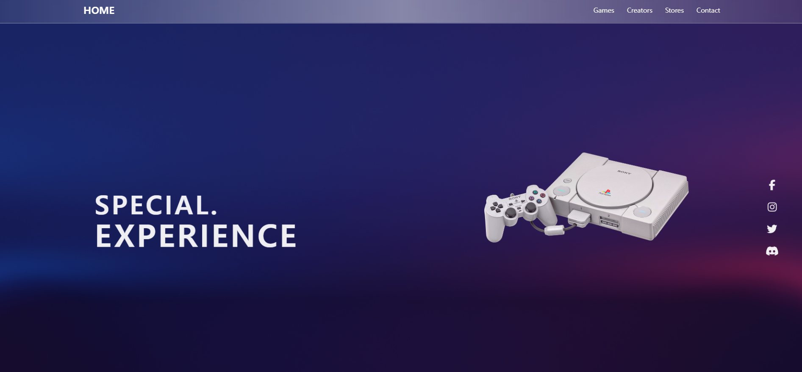

  
  <h1>VideoGame database</h1>

<h4>
    <a href="">View Demo</a>
  </h4>

 

<!-- Table of Contents -->

# :notebook_with_decorative_cover: Table of Contents

## :star2: About the Project

  
React-query의 쓰임과 이해도를 높이기 위해서 RAWG API를 이용한 다양한 게임 정보를 불러오는 프로젝트

<!-- Screenshots -->

### :camera: Screenshots

 
  

<!-- TechStack -->

### :space_invader: Tech Stack

  

  
  
  
  
  
  

<!-- Env Variables -->

### :key: Environment Variables

`REACT_APP_RAWG_API_KEY`

<!-- Acknowledgments -->

## :gem: Acknowledgements

- [Using RAWG API](https://rawg.io/apidocs)
